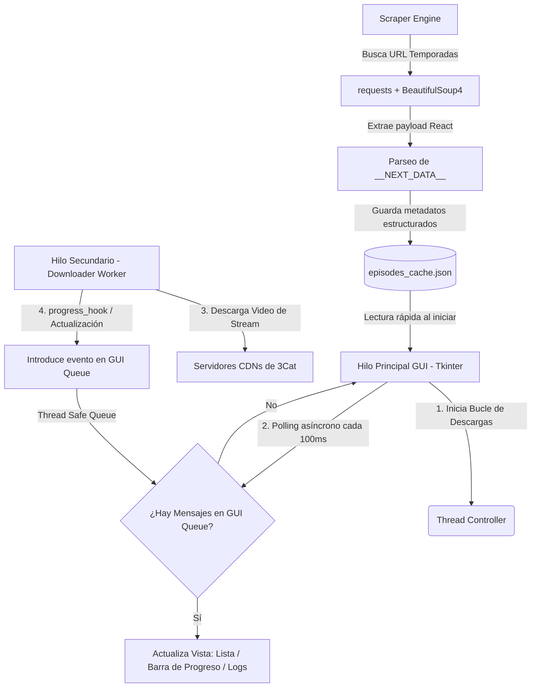

# 🚀 Merlí - Descargador Autónomo de Episodios v1.0.0

> **He desarrollado este gestor de descargas gráfico y multihilo en Python de código abierto para automatizar y ordenar la descarga y preservación de las temporadas 1, 2 y 3 de la aclamada serie "Merlí" desde el portal oficial de 3Cat.**

---

## 📌 Descripción General

Mi script automatiza por completo el proceso de extracción de metadatos de los capítulos de la serie desde la web de **3Cat** (anteriormente TV3/CCMA). También almacena una caché local para acelerar la inicialización, lleva un registro pormenorizado del estado de cada descarga para evitar bajar contenido duplicado y gestiona descargas concurrentes y resilientes mediante un wrapper optimizado del motor **`yt-dlp`**.

---

## 🪄Instrucciones

Para que puedas ejecutar mi script en tu máquina, necesitas contar con Python instalado y algunas librerías básicas.

### 1. Requisitos Previos
* **1 - Python 3.8** o superior : https://www.python.org/downloads/
  

### 2. Ejecución

* **doble clic en :** run.bat esto iniciará la consola, y llamará al script de Python .
  
* Dependencias : instala las dependecias que te pide (tarda 3 min aprox en total).

Este software es de OpenSource sin ánimo de lucro.

## 📖 Manual de Instrucciones de Uso

He diseñado la interfaz de la aplicación para que sea súper intuitiva y autónoma:

1. **Carga Inicial:** Al abrir la aplicación por primera vez, se conectará a internet en segundo plano para raspar los metadatos de los capítulos directamente de 3Cat. Una vez obtenidos, se guardarán en un caché local (`episodes_cache.json`). En ejecuciones posteriores, la carga será instantánea usando dicho caché.
   
3. **Visualizar Episodios:** La tabla izquierda lista todos los capítulos ordenados con su código identificador (`S01E01`, `S01E02`...), su título limpio, su estado actual y el progreso.
4. **Iniciar las Descargas:**
   
   * Haz clic en **🚀 INICIAR**. El descargador comenzará automáticamente a procesar el primer capítulo con estado **Pendiente** o **Fallido**.
   * Una vez completado un episodio con éxito, actualizará su estado a `✅ Completado` y pasará de inmediato al siguiente de forma secuencial y autónoma.
     
6. **Pausar/Detener:**
   * Si deseas pausar las descargas, haz clic en **🛑 DETENER**. La aplicación esperará a que termine de manera segura la descarga en curso o cancelará la conexión de forma segura para no corromper archivos parciales.
     
7. **Acciones Adicionales:**
   * **📁 Abrir Carpeta Videos:** Abre directamente en el explorador de tu sistema el directorio donde se están guardando los videos (por defecto, la carpeta nativa `Videos` de tu usuario en Windows: `C:\Users\<Usuario>\Videos`).
   * **🔄 Buscar Episodios Web:** Si la serie recibe actualizaciones en la web de 3Cat o deseas forzar una actualización del catálogo, este botón limpiará la caché y volverá a realizar el raspado en tiempo real.
=======

### Acciones Adicionales:
* 📁 Abrir Carpeta Videos: Abre directamente en el explorador de tu sistema el directorio donde se están guardando los videos (por defecto, la carpeta nativa Videos de tu usuario en Windows: C:\Users\<Usuario>\Videos).
* 🔄 Buscar Episodios Web: Si la serie recibe actualizaciones en la web de 3Cat o deseas forzar una actualización del catálogo, este botón limpiará la caché y volverá a realizar el raspado en tiempo real.

---

## ⚙️ Funcionamiento Técnico Interno (Arquitectura)

A nivel interno, estructuré la aplicación bajo patrones de diseño asíncronos y robustos para evitar bloqueos de la interfaz y asegurar que las descargas no se interrumpan.

### 1. El Motor de Raspado (Scraper Engine)
En lugar de depender de técnicas frágiles de parsing de HTML que se rompen al mínimo cambio de diseño de la web, programé la extracción de datos directamente desde el **estado de hidratación de React/Next.js**:
* El script realiza peticiones HTTP con un encabezado `User-Agent` simulado de navegador moderno a las tres URLs de las temporadas de **3Cat**.
* Mediante **BeautifulSoup**, localiza la etiqueta de script `<script id="__NEXT_DATA__">`. Esta etiqueta contiene un objeto JSON con toda la información interna que Next.js inyecta en la página durante el renderizado en servidor.
* Implementé una función recursiva profunda `extract_items_recursive(obj)` para buscar dentro de este complejo JSON la clave de arreglo `items` que contiene los metadatos crudos (`nom_friendly`, `id` de video, `titol`, `capitol_temporada`...).
* **Sanitizado:** Limpio los títulos eliminando prefijos redundantes (como "T1xC1 - ") y caracteres no válidos para nombres de archivo de Windows (`\ / : * ? " < > |`).

### 2. Arquitectura Multihilo No Bloqueante (Multithreading & Queue)
Como programar interfaces con Tkinter en un solo hilo puede congelar la ventana durante tareas pesadas, implementé una arquitectura multihilo no bloqueante:
* **El Worker de Descarga:** Cada vez que se procesa un episodio, mi código inicia un hilo de ejecución independiente (`threading.Thread(target=self.download_thread_worker, ...)`).
* **Cola de Comunicación Segura (`queue.Queue`):** Como Tkinter **no es seguro para subprocesos** (thread-safe) y no se deben manipular controles de la GUI directamente desde un hilo secundario, realizo la comunicación mediante una cola segura de tipo FIFO.
* **Polling en Loop Asíncrono:** Registro un temporizador asíncrono repetitivo mediante `self.root.after(100, self.poll_queue)`. Cada 100 milisegundos, el hilo de la GUI consulta la cola `gui_queue`. Si hay datos (logs, progreso de descarga, finalizaciones), actualizo los widgets de forma segura en el hilo principal.

### 3. Integración Resiliente de yt-dlp
Para la descarga real de los flujos de video, integré **`yt-dlp`** configurado minuciosamente con estas propiedades:
* **Formato `best`:** Fuerzo la descarga del mejor flujo integrado único. De esta forma, **evito requerir que tengas instalado `ffmpeg` en tu sistema** (el cual es indispensable si se descargaran pistas de audio y video por separado para mezclarlas en un solo archivo).
* **Hook de Progreso Continuo (`progress_hooks`):** Intercepto los reportes periódicos de descarga de `yt-dlp` para calcular dinámicamente el porcentaje completado y la velocidad de transferencia, enviándolos inmediatamente a la GUI a través del sistema de colas.
* **Bucle de Auto-Curación (Self-Healing Retry Loop):** Envolví la descarga en un bucle externo de control de hasta **4 intentos**. Si la conexión a los servidores de streaming de 3Cat se interrumpe temporalmente, la aplicación no falla; en su lugar, espera 5 segundos de cortesía, verifica que no hayas cancelado y reintenta automáticamente la petición.
* **Soporte de Reanudación (`continuedl` y `continued`):** Si un archivo se descargó parcialmente, le indico a `yt-dlp` que continúe la descarga desde el último byte guardado en lugar de iniciar desde cero, ahorrando ancho de banda y tiempo.

### 4. Persistencia de Estados
Para que todo sea súper resiliente, el programa gestiona dos bases de datos JSON planas locales:
1. **`episodes_cache.json`**: Almacena los metadatos completos y limpios de todos los episodios scrapeados para que la aplicación funcione incluso sin conexión a internet para renderizar la lista inicial.
2. **`download_state.json`**: Almacena un diccionario clave-valor relacionando el `video_id` de cada capítulo con su estado en el disco (`pending`, `downloading`, `completed`, `failed`). Esto permite que puedas cerrar la aplicación a la mitad de una descarga y, al volver a abrirla días después, sepa con total certeza qué capítulos ya están descargados y cuáles quedaron pendientes de completar.

---

## 📂 Estructura del Directorio de Trabajo

Aquí tienes la estructura de los archivos que he creado y mantenido en mi espacio de trabajo:

* 📄 **[downloader.py](file:///c:/Users/fermi/.gemini/antigravity/scratch/merli_downloader/downloader.py)**: Mi archivo fuente principal de Python con el motor completo de la aplicación, la lógica de raspado, el gestor de hilos de descargas y la interfaz de usuario de Tkinter.
* 📄 **[run.bat](file:///c:/Users/fermi/.gemini/antigravity/scratch/merli_downloader/run.bat)**: Archivo por lotes ejecutable para Windows que lanza el descargador de manera cómoda sin lidiar con la terminal.
* 💾 **[episodes_cache.json](file:///c:/Users/fermi/.gemini/antigravity/scratch/merli_downloader/episodes_cache.json)**: Archivo generado automáticamente que almacena la estructura interna de los capítulos de las Temporadas 1, 2 y 3.
* 💾 **[download_state.json](file:///c:/Users/fermi/.gemini/antigravity/scratch/merli_downloader/download_state.json)**: Archivo de persistencia de progreso generado automáticamente para garantizar la resiliencia del trabajo realizado.

---

## ⚖️ Licencia y Uso Libre
He publicado este software como **código abierto** y libre de modificaciones bajo propósitos educativos, de investigación y para la preservación personal de contenido de televisión pública.
=======
He sido ayudado con una IA.

